# Adaptive Object-Oriented Database Framework

This project builds an autonomous JSON data pipeline that:
- ingests records,
- analyzes field behavior,
- classifies each field to SQL, MongoDB, or Buffer,
- generates storage and CRUD plans,
- executes hybrid CRUD,
- aggregates SQL + Mongo outputs into one JSON response.

## Flow


Flow: Ingest API -> Schema Registry -> Analyzer/Classifier -> Strategy -> CRUD Executor -> MySQL/MongoDB -> Result Aggregator -> Unified JSON response.

## Step Coverage (1 to 11)
1. Ingestion and normalization
2. SQL/Mongo routing
3. Metadata persistence
4. Structure and pipeline analysis
5. SQL normalization blueprint
6. Mongo embed/reference strategy
7. Storage strategy generation
8. Ingest endpoint and buffer promotion
9. CRUD query plan generation
10. Hybrid CRUD execution
11. Result aggregation

## Project Structure
Core modules and their roles:

- `main.py`: orchestrates ingestion pipeline.
- `schema_registry_api.py`: FastAPI endpoints.
- `schema_registry.py`: schema + metadata persistence.
- `schema_analyzer.py`: JSON structure analysis.
- `classifier.py`, `classification_engine.py`: field routing logic.
- `sql_normalization_engine.py`: relational table blueprint.
- `mongo_strategy_engine.py`: document strategy.
- `storage_strategy_generator.py`: SQL/Mongo physical strategy.
- `crud_query_engine.py`: SQL/Mongo read plan synthesis.
- `crud_executor.py`: execution engine.
- `result_aggregator.py`: SQL + Mongo merge layer.
- `buffer_queue.py`, `buffer_promoter.py`: delayed promotion for uncertain fields.
- `metadata_manager.py`: metadata tracking.

Supporting directories/files:
- `tests/`: requirement-wise and workflow tests.
- `docs/request-flow.svg`: visual request flow used in this README.
- `metadata.json`: generated metadata output.
- `requirements.txt`: Python dependency list.

## API Endpoints
- `POST /register_schema`
- `GET /schemas`
- `GET /schemas/{schema_id}`
- `POST /schemas/{schema_id}/query_plan`
- `POST /schemas/{schema_id}/crud`
- `POST /ingest/{schema_id}`

## Steps To Execute The Code
1. Create and activate virtual environment.
2. Install dependencies:
```bash
pip install -r requirements.txt
```
3. Verify setup:
```bash
uvicorn simulation_code:app --reload --port 8000
```

---

## Logical Dashboard (CLI)

`logical_dashboard_cli.py` provides a minimal logical dashboard that lists active session
details, logical entities, logical instances, and logical query results without exposing
backend-specific storage details.

### Quick start

```bash
python logical_dashboard_cli.py
```

### List logical entities

```bash
python logical_dashboard_cli.py --list-entities
```

### Show entity details + sample instances

```bash
python logical_dashboard_cli.py --entity 1
```

### Run a logical query (dry-run by default)

```bash
python logical_dashboard_cli.py --query 1 --fields "username,comments" --limit 5
```

### Execute against live backends

```bash
python logical_dashboard_cli.py --query 1 --fields "username,comments" --limit 5 --execute
```

Environment options:

- `SCHEMA_REGISTRY_DB` (default: `schema_registry.db`)
- `METADATA_FILE` (default: `metadata.json`)
- `DASHBOARD_EXECUTE=1` to default queries to execute mode

---

## Logical Dashboard (Web)

`dashboard_web.py` serves a local-hosted web dashboard for logical entities and queries.
It hides backend-specific details and exposes only logical results.

```bash
uvicorn dashboard_web:app --reload --port 8003
```

Open in a browser: `http://127.0.0.1:8003`

Dashboard pages:

- Home: session summary
- Entities: logical schema list
- CRUD: insert/update/delete/read forms with logical summaries
- ACID Report: current backend data snapshot + integrity checks
- Test Connection: MySQL/Mongo connectivity status
- Query History: recent logical requests

Environment options:

- `SCHEMA_REGISTRY_DB` (default: `schema_registry.db`)
- `METADATA_FILE` (default: `metadata.json`)
- `DASHBOARD_EXECUTE=1` to default queries to execute mode

<<<<<<< HEAD
## Schema Registry API

The schema registry lets you register the structure of any incoming JSON entity and keeps a metadata catalog of every field. It runs as its own FastAPI service.

1. Start the registry service (choose any available port, 8002 used below):

```bash
uvicorn schema_registry_api:app --reload --port 8002
```
5. Run tests (recommended before pipeline run):
```bash
python -m pytest
```
6. Run pipeline (optional stream run):
```bash
curl http://localhost:8002/schemas
curl http://localhost:8002/schemas/1
```

Each schema is stored in `schema_registry.db` with entries in `schemas` and `fields` tables so you always have a registry describing every field.

### Auto-create SQL tables

By default, the registry now attempts to auto-create SQL tables using the generated DDL during schema registration. 
Disable it by setting:

```bash
AUTO_CREATE_SQL=0
```

### Auto-create Mongo collections

Mongo collections can be auto-provisioned during schema registration. Disable with:

```bash
AUTO_CREATE_MONGO=0
```

### Reset registry metadata

Use the reset endpoint to wipe `schema_registry.db` (only when safe):

```bash
POST /reset_registry
```

### Auto-create SQL on insert

Insert execution attempts to create missing SQL tables before writes. Disable with:

```bash
AUTO_CREATE_SQL_ON_INSERT=0
```

If a table already exists, missing columns can be auto-added during inserts.
Disable column auto-alter with:

```bash
AUTO_ALTER_SQL=0
```

### Transaction coordination

CRUD write operations are executed as a single logical transaction across SQL + Mongo.
This attempts SQL transactions and Mongo transactions when supported, with compensating
rollbacks if Mongo is not running as a replica set.
Disable transaction coordination with:

```bash
TRANSACTION_COORDINATION=0
```

### Auto-extend schema from payloads

When enabled, inserts/updates will extend the registered schema with new fields
found in the payload and regenerate blueprints/strategies before execution.
Disable with:

```bash
AUTO_EXTEND_SCHEMA=0
```

### Step 3 — JSON Structure Analyzer

Whenever you register a schema (or even a raw JSON example), the registry now auto-runs the JSON Structure Analyzer. It infers structural patterns, highlights recommended storage actions, and surfaces a quick human-readable summary such as `comments -> repeating entity`.

Detected patterns and meanings:

| Pattern | Meaning |
|---------|---------|
| nested object | possible new table |
| array of objects | repeating entity |
| array of primitives | embed |
| deep nesting | candidate for Mongo |

Example input:

```json
{
	"username": "user1",
	"post_id": 123,
	"comments": [
		{"text": "nice", "time": 123}
	]
}
```

Analyzer output snippet:

```
username -> simple field
post_id -> simple field
comments -> repeating entity
comments.text -> attribute
comments.time -> attribute
```

This information is persisted alongside the schema metadata and exposed via the `analysis.readable` list in the registry API responses.

### Step 4 — Data Classification Engine

Building on the structural analysis, every registered field is now routed to one of three pipelines:

| Pipeline | Use When | Examples |
|----------|----------|----------|
| SQL | Structured data, clear parent/child relations, repeating entities that translate nicely into tables. | `users`, `posts`, `comments` |
| MongoDB | Deeply nested objects, large or flexible documents, array-heavy payloads that need embedding. | `user_profiles`, `logs`, `activity_history` |
| Buffer | Temporary landing zone when the schema is incomplete, ambiguous, or still gathering samples. | `buffer_fields` |

Every analyzer entry reports `pipeline`, `pipeline_reason`, and `pipeline_confidence`, and the registry summary exposes aggregate counts so downstream services can provision tables/collections automatically.

### Step 5 — SQL Normalization Engine

After pipelines are assigned, the registry builds a relational blueprint so SQL teams can materialize tables instantly. The engine follows three detection rules:

| Rule | Trigger | Result |
|------|---------|--------|
| Rule 1 | Array of objects (e.g., `comments[]`) | Create a new table named after the array (`comments`) with its own primary key. |
| Rule 2 | Nested object (e.g., `profile.age`) | Create a separate table for the object (`profile`) and link it back to its parent. |
| Rule 3 | Root entity (`users`) | Create the main table for the entity being registered. |

Generated tables automatically include:

- Primary keys named `<table>_id` using `SERIAL`.
- Foreign keys that connect child tables back to their parents (e.g., `comments.post_id → posts.post_id`).
- Column types inferred from the schema analyzer (`string` → `TEXT`, `integer` → `BIGINT`, etc.).

The resulting blueprint (tables, relationships, and rules applied) is stored in the registry database and returned via the API so migrations or ORMs can consume it directly.

### Step 6 — MongoDB Document Strategy

Any field routed to the MongoDB pipeline now passes through the document strategy engine to decide whether it should be embedded inside a parent document or broken out into its own collection with references.

Embedding heuristics (store inline with the parent document):

- **Small arrays** (`array of primitives`, shallow `embedded_list`).
- **Rarely updated attributes** such as profile, address, or preferences.
- **Tightly coupled nested objects** with depth ≤ 1 and no deep-nesting flags.

Referencing heuristics (separate collection with `ObjectId` / foreign key back to parent):

- **Large arrays of objects** (`repeating_entity`, `array of objects`).
- **Frequently updated or shared data** (e.g., `orders`, `products`).
- **Deeply nested objects** (depth ≥ 3 or flagged `deep_nesting`).

Example outcomes:

```
users
{
	username: "user1",
	profile: { age: 25, city: "NYC" },        # embedded (tightly coupled)
	orders: [ObjectId("...")],                 # references (large array of objects)
}

orders
{
	user_id: ObjectId("..."),
	product_id: ObjectId("..."),
	total: 42.15
}
```

The engine emits `mongo_strategy` artifacts containing per-field decisions, embedded/reference summaries, and document-level recommendations so downstream services can build MongoDB collections or ORMs without re-deriving these heuristics.

### Step 7 — Storage Strategy Generator

The final stage assembles executable storage plans once SQL/Mongo decisions are known:

- **SQL DDL:** Every table from the blueprint is rendered into `CREATE TABLE ...` statements (including foreign keys) so migrations can run immediately.
- **Mongo Collections:** For each recommended collection, the service outputs `db.createCollection("name")` commands along with embedded/reference notes.
- **Field mappings:** A unified mapping links each `field_path` to its physical destination (table+column or collection) so metadata systems always know where data lands.

These artifacts are persisted inside the registry (`storage_strategy`) and surface through the API, enabling downstream automation (Flyway/Liquibase migrations, Mongo provisioning scripts, or metadata dashboards).

### Step 8 — JSON Ingestion API & Buffer Promotion

Step 8 exposes a purpose-built ingestion surface so producers can hand raw JSON to the registry and let the metadata drive writes automatically.

1. Dry-run or execute inserts:

```powershell
curl -X POST http://localhost:8002/ingest/1 `
	-H "Content-Type: application/json" `
	-d '{
		"payload": {
			"username": "user1",
			"post_id": 42,
			"comments": [{"text": "nice"}]
		},
		"execute": false
	}'
```

`execute=false` (default) returns the SQL/Mongo insert plan plus a `buffered_fields` array listing anything still routed to the buffer pipeline. Set `execute=true` to hit MySQL/Mongo immediately once every field is mapped.

2. Buffer queue + promotion service:

- Undecided fields (pipeline = `buffer`) are written to `buffer_queue` inside `schema_registry.db` together with the original payload snapshot.
- Once classification matures, run `buffer_promoter.py` to replay those payloads. It can be scheduled via cron/Task Scheduler.

```powershell
python buffer_promoter.py --schema-id 1 --limit 25           # dry-run (plan only)
python buffer_promoter.py --schema-id 1 --limit 25 --execute  # run live CRUD updates

To auto-create a new entity using the most frequent buffered field:

```bash
python buffer_promoter.py --auto-entity --limit 200 --min-count 3
```
```

The promoter inspects pending entries, skips anything still marked `buffer`, and for ready fields reissues an `update` (delete + insert) through `HybridCRUDExecutor`. On success the queue item is marked `processed`, keeping Pipeline 1 compliant with the assignment requirement of “until enough information is available.”

### Step 9 — Automatic CRUD Query Engine

Users can now describe a simple CRUD request as JSON and let the registry produce executable SQL/Mongo plans. The new endpoint lives alongside the schema registry service:

```powershell
uvicorn schema_registry_api:app --reload --port 8002
```

Then POST a query description:

```bash
python -m pytest tests/test_requirement1_normalization.py
python -m pytest tests/test_requirement2_table_keys.py
python -m pytest tests/test_requirement3_mongo_strategy.py
python -m pytest tests/test_requirement4_metadata_system.py
python -m pytest tests/test_requirement5_crud_generation.py
python -m pytest tests/test_requirement6_performance.py
python -m pytest tests/test_requirement7_sources.py
```

## Environment Variables
Defaults:
- `MYSQL_HOST=localhost`
- `MYSQL_USER=root`
- `MYSQL_PASSWORD=devil`
- `MYSQL_DATABASE=streaming_db`
- `MONGO_HOST=localhost`
- `MONGO_PORT=27017`
- `MONGO_DATABASE=streaming_db`
- `MONGO_COLLECTION=logs`

Use `.env` to override.

## Useful Commands
```bash
curl -X POST http://localhost:8002/schemas/1/crud \
	-H "Content-Type: application/json" \
	-d '{
				"operation": "insert",
				"payload": {
					"username": "user1",
					"post_id": 42,
					"comments": [
						{"text": "hi", "upvotes": 1},
						{"text": "bye", "upvotes": 3}
					]
				},
				"execute": false
			}'
```

If you only have a raw JSON payload and want the system to register the entity automatically,
use the auto CRUD endpoint:

```bash
curl -X POST http://localhost:8002/crud_auto \
	-H "Content-Type: application/json" \
	-d '{
		"entity": "user_activity",
		"operation": "insert",
		"payload": {"username": "alice", "post_id": 10, "comments": [{"text": "nice"}]},
		"execute": true
	}'
```

`execute=false` (default) returns a plan so you can inspect the SQL inserts, Mongo docs, or DELETE cascade without touching the databases. Flip it to `true` in production to run the statements directly using the configured MySQL/Mongo credentials.

### University dataset ingest

`university_ingest.py` splits `university_data.json` into logical entities so you don't end up with a
single `university` field and no columns. It inserts `university`, `department`, `program`,
`faculty_member`, `student`, `course`, and `placement` records through `/crud_auto`.

Dry-run (inspect planned inserts):

```bash
python university_ingest.py --file university_data.json
```

Execute inserts:

```bash
python university_ingest.py --file university_data.json --execute
```

Supported operations:

| Operation | Flow |
|-----------|------|
| `insert`  | Parse JSON → split fields by storage strategy → insert SQL tables (respecting FK order) → insert Mongo docs → report generated keys. |
| `read`    | Reuses Step 9 planner, optionally executes SQL + Mongo queries and merges on a shared key. |
| `update`  | `simple` mode = delete + reinsert; `advanced` mode issues targeted `UPDATE` / `$set` statements per field placement. |
| `delete`  | `entity` cascades through all SQL tables + Mongo collections; `sub-entity` focuses on a specific table/collection (e.g., `comments`). |

Example payload for deleting a nested comment:

```json
{
	"operation": "delete",
	"strategy": "sub-entity",
	"filters": {
		"target": "comments",
		"criteria": {"post_id": 42, "comment_id": 7}
	},
	"execute": false
}
```

The response returns both SQL and Mongo plans with exact statements so teams can audit, dry-run, or let the service execute them automatically.

### Step 11 — Result Aggregation Layer

Step 9 produced merge plans and Step 10 could execute SQL + Mongo queries, but clients still needed to stitch the raw row sets. Step 11 introduces `result_aggregator.py`, a dedicated layer that rebuilds the original JSON shape before shipping it back to callers.

- **Input sources:** dictionary rows from MySQL (with aliases like `users_username`) and projected Mongo documents.
- **Metadata aware:** uses `storage_strategy.mappings` to map SQL aliases back to logical field paths and deduces merge keys from the planner (fallbacks such as `username`, `user_id`, `_id`).
- **Smart merging:** de-dupes records per merge key, recursively merges dictionaries, and concatenates arrays so nested structures (e.g., `comments`) survive intact.
- **Clean outputs:** drops `_collection` helpers, stringifies Mongo `_id` values, and emits a tidy list matching the original schema.

`HybridCRUDExecutor` now wires the aggregator automatically during read operations. When `execute=true`, the `/schemas/{id}/crud` endpoint responds with:

```json
{
	"message": "CRUD operation processed",
	"result": {
		"operation": "read",
		"executed": true,
		"details": {
			"sql": {...},
			"mongo": [...],
			"merge": {
				"merge_key": "username",
				"strategy": "client_side_join"
			},
			"result_summary": {
				"sql_rows": 1,
				"mongo_documents": 1,
				"merged_items": 1
			},
			"results": [
				{
					"username": "user1",
					"comments": [
						{"text": "nice", "time": 123}
					]
				}
			]
		}
	}
}
```

This means the API now returns the fully fused JSON payload straight out of the registry, no custom client transformers required. The same aggregator can also be reused by future ingestion/reporting jobs to guarantee consistent output formatting.

## Metadata Manager (Step 2)

The enhanced `MetadataManager` now tracks the full structural context required in Step 2:

| Attribute | Purpose |
|-----------|---------|
| Field name | Canonical identifier for the attribute (supports nested paths like `comments.text`). |
| Data type | Normalized type hint used for routing decisions. |
| Nesting level | Depth inside the JSON payload to surface relational patterns. |
| Parent field | Immediate parent (e.g., `comments` for `comments.text`). |
| Storage engine | `SQL`, `Mongo`, or `Buffer`, derived from placement heuristics. |
| Table / collection | Destination entity (e.g., `comments` table for nested SQL arrays). |
| Key relationships | Primary/foreign key hints so nested arrays can map back to root entities. |

### Try the structural registry demo

```powershell
& ".venv\Scripts\python.exe" metadata_demo.py
```

This script generates `metadata_demo.json` and prints entries such as:

```
field: comments.text
type: string
nest_level: 2
parent: comments
storage: SQL
table: comments
foreign_key: post_id
```

The same information is accessible in runtime via `MetadataManager.get_structural_registry()` and exposed through `metadata.json` for downstream services.
=======
The API will run at:

```
http://127.0.0.1:8000
```

## Key Features
- Streaming ingestion from an SSE/HTTP source (see `simulation_code.py`).
- Field-level analysis: type detection, semantic signals, uniqueness and stability (`analyzer.py`, `classifier.py`).
- Type-drift detection and quarantine logic (`drift_detector.py`).
- Hybrid storage with bi-temporal timestamps and routing to MySQL + MongoDB (`storage_manager.py`).
- Enhanced metadata storage and reporting (`metadata_manager.py`, `analyze_metadata.py`).

## Requirements
- Python 3.9+ (or compatible)
- See `requirements.txt` for Python dependencies. Install with:

```bash
python -m pip install -r requirements.txt
```

## Metadata and Reports
- `metadata.json`: generated metadata store.
- `analyze_metadata.py`: metadata summary/export utility.

Run:
```bash
python analyze_metadata.py
python analyze_metadata.py export
python analyze_metadata.py <field_name>
```

## Troubleshooting
- If setup fails: run `verify_setup.py` and `db_connectivity_check.py`.
- If ingestion fails: ensure simulation service is running on expected host/port.
- If DB failures occur: verify MySQL/Mongo status and `.env` credentials.

## Tests and Current Status
Requirement-focused tests are present under `tests/` and include normalization, key logic, Mongo strategy, metadata system, CRUD generation, performance, and sources coverage.
